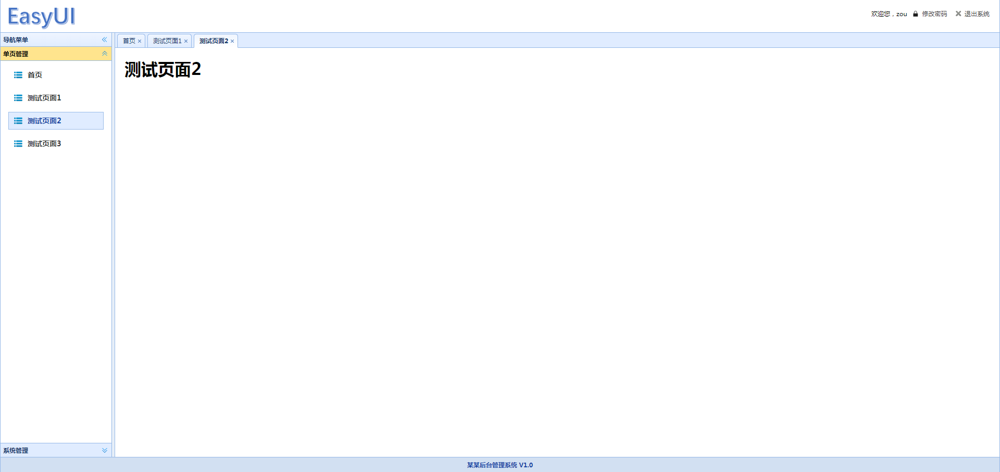

# easyui-rbac
基于thinkphp5.0和easyui开发的简单的rbac通用项目

<h2>作者长期从事程序开发</h2>
<pre>
<ul>
<li>昵称:datou</li>
<li>qq:2323178881</li>
<li>Tel:18329123270</li>
<li>微信:datou-leo</li>
<li>ci使用开发群:646864389</li>
</ul>
<pre>
# 管理员界面预览

1.管理员访问用户列表
--

2.管理员编辑用户角色

3.管理员为角色设置权限

4.管理员访问权限列表

5.管理员添加权限

# 普通用户界面预览

1用户访问有权限的首页

2用户菜单

3.用户访问有权限测试页面2

4.用户访问有权限的用户列表

5.用户访问操作无权限的编辑用户

